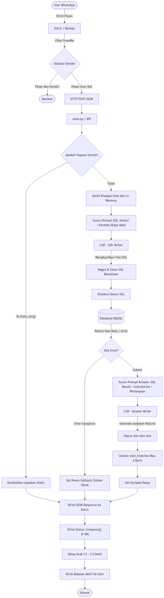

# 🎓 AI-Powered PMB Virtual Assistant - ITATS

<p align="center">
  
</p>

## 📌 Overview
Sistem Asisten Virtual cerdas berbasis WhatsApp yang dirancang khusus untuk mengelola pertanyaan seputar Penerimaan Mahasiswa Baru (PMB) di Institut Teknologi Adhi Tama Surabaya (ITATS). 

Aplikasi ini menggunakan pendekatan arsitektur **Microservices** ringan, yang menggabungkan keandalan WhatsApp WebSockets di sisi *front-end* dengan ketangguhan pemrosesan Natural Language Processing (NLP) menggunakan LangChain dan *Large Language Models* (LLM) di sisi *back-end*. Keunggulan utama sistem ini adalah kemampuannya mengubah bahasa manusia (*natural language*) secara dinamis menjadi kueri SQL (**Text-to-SQL**) dan mengambil informasi akurat langsung dari basis data sebelum menjawab pertanyaan pendaftar.

## ✨ Key Features
- 🚀 **Real-time WhatsApp Integration**: Menggunakan `@whiskeysockets/baileys` yang stabil untuk mendengarkan dan mengirim pesan secara *real-time*.
- 🛡️ **Anti-Ban / Evasion Mechanisms**: Sistem disematkan fungsi *typing simulation* (jeda waktu pengetikan acak) dan modifikasi *User-Agent* (MacOS Desktop) untuk menghindari *banned* dari sistem WhatsApp.
- 🧠 **Dynamic Text-to-SQL (LangChain)**: Tidak bergantung pada *hardcoded intents*, chatbot ini mampu mengerti berbagai struktur pertanyaan kompleks (biaya, jurusan, jadwal) dan membuat *SQL query* secara *on-the-fly*.
- 🔒 **Zero Hallucination Protocol**: LLM telah diprogram dengan ketat (lewat `instruksi.txt`) untuk **hanya** memberikan informasi biaya atau jurusan yang ditemukan dalam hasil *query* database. Jika data tidak ada di SQL, bot tidak akan mengarang jawaban.
- ⚡ **In-Memory Chat History**: Menyimpan konteks percakapan sementara untuk memungkinkan sesi tanya jawab berkelanjutan yang *natural* tanpa membebani penyimpanan (Max 3 dialog per user).

## 🏗️ System Architecture
1. **`bot.js` (Node.js)**: 
   Bertindak sebagai *gateway* komunikasi dengan WhatsApp. Bertanggung jawab memvalidasi *sender*, menolak pesan dari bot sendiri, dan meneruskan *payload* JSON ke API Python. 
2. **`main.py` (Python Flask)**: 
   Engine NLP utama. Menerima *payload*, menyuntikkan *system prompt* dari `instruksi.txt`, menghubungi LLM untuk membentuk kueri SQL, menjalankan kueri di MySQL, dan memformulasikan hasil *query* kembali ke bahasa manusiawi.
3. **`instruksi.txt`**: 
   Kumpulan *System Prompts* (Aturan dan Gaya Bahasa) untuk membatasi ruang gerak AI (menjaga *tone* sopan, aturan 2025/2026, validasi S1/S2/RPL, dilarang Markdown table).

## 🛠️ Tech Stack
- **Client Service**: Node.js, Baileys, Axios, QRCode-Terminal
- **NLP API Service**: Python, Flask, LangChain, LangChain-Ollama (Model: `minimax-m3:cloud`), SQLAlchemy, PyMySQL
- **Database**: MySQL (`daft_online`)

## 🚀 Installation & Deployment

### Prerequisites
- Node.js (v16+)
- Python (3.9+)
- MySQL Server (dengan skema database PMB yang relevan)

### 1. Clone & Setup Database
Clone repositori dan atur variabel lingkungan (*environment variables*).
```bash
git clone https://github.com/prawira-rexsa/kerja-praktek-chatbot-pmb.git
cd kerja-praktek-chatbot-pmb
```
Ubah atau buat file `.env` di root directory:
```env
DB_USER=root
DB_PASSWORD=your_password
DB_HOST=localhost
DB_NAME=daft_online
```

### 2. Setup NLP Backend (Python)
```bash
pip install flask python-dotenv sqlalchemy pymysql langchain langchain-community langchain-ollama
python main.py
```
> API akan aktif di `http://127.0.0.1:5000/api/chat`

### 3. Setup WhatsApp Client (Node.js)
Buka terminal baru:
```bash
npm install
node bot.js
```
> Scan QR Code yang muncul di terminal menggunakan aplikasi WhatsApp (Tautkan Perangkat).

---
*Developed for Kerja Praktek PMB ITATS.*
